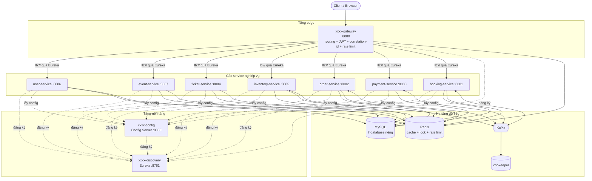
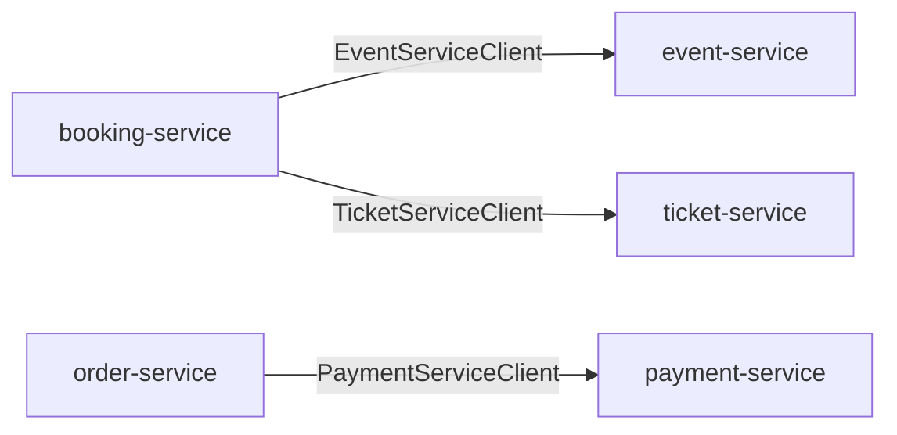
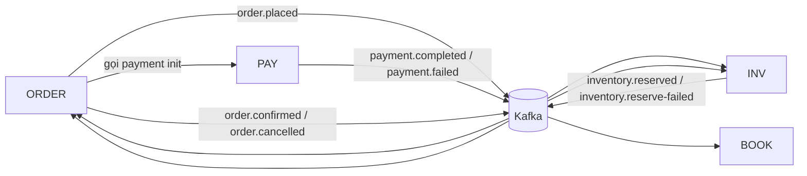
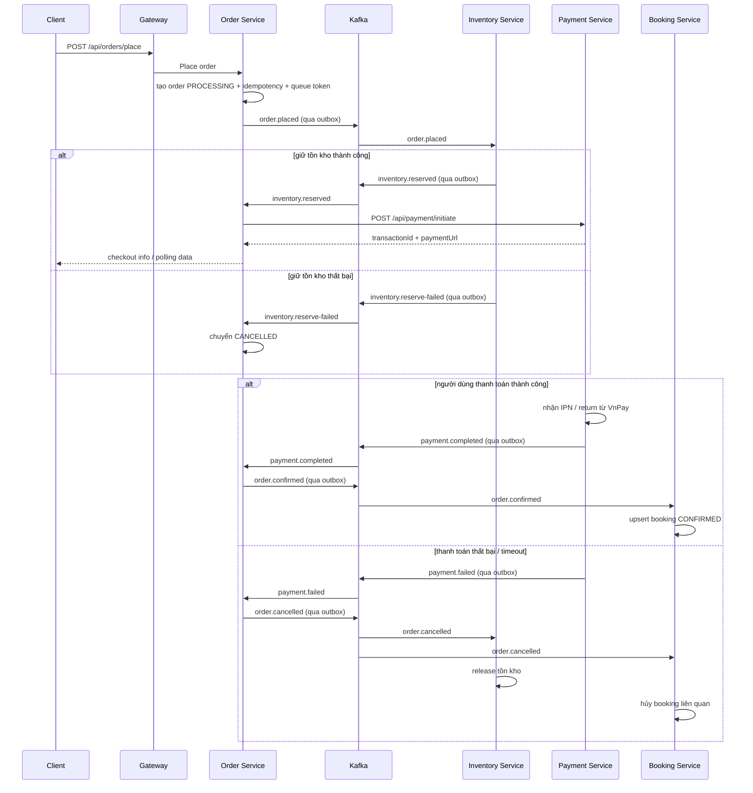

# Kiến trúc tổng quan - xxxx Microservices

Tài liệu này mô tả kiến trúc hiện tại của hệ thống bán vé trong repo, dựa trên source code,
`docker-compose.yml`, `environment/config-repo` và các module Maven đang có.

## 1. Kiến trúc tổng thể



### Những điểm đáng chú ý

- Gateway là entrypoint public chính trong Docker Compose.
- Mỗi service sở hữu DB riêng: `booking_db`, `order_db`, `payment_db`, `ticket_db`, `inventory_db`, `user_db`, `event_db`.
- Redis đang được dùng cho nhiều mục đích khác nhau: cache, tồn kho nhanh, distributed lock, rate limiting.
- Kafka hiện phục vụ luồng Saga giữa `order-service`, `inventory-service`, `payment-service`, `booking-service`.

## 2. Giao tiếp giữa các service

### 2.1 Đồng bộ qua Feign



Đặc điểm:

- Dùng service name qua Eureka, không hard-code host service khi chạy runtime.
- Có fallback / resilience để giảm vỡ dây chuyền khi service đích lỗi.
- Phù hợp cho các nghiệp vụ cần phản hồi tức thời, ví dụ đọc thông tin event/ticket hoặc tạo payment ban đầu.

### 2.2 Bất đồng bộ qua Kafka



Đặc điểm:

- Dùng cho Saga dài và các bước cần bù trừ.
- Chịu được at-least-once delivery nên consumer phải idempotent.
- Order, inventory, payment đang dùng outbox để publish event sau khi transaction DB đã commit.

## 3. Luồng Saga đặt vé hiện tại



### Các cơ chế bảo vệ đã có trong code

- **Idempotency-Key** cho `POST /api/orders/place`.
- **Timeout auto-cancel** cho đơn đang chờ thanh toán quá hạn.
- **Consumer guard theo trạng thái** để xử lý duplicate event an toàn hơn.
- **Outbox publisher** cho order, inventory, payment.
- **Booking upsert theo `orderNo`** để tránh tạo trùng khi nhận event lặp.

## 4. Topic Kafka hiện có

| Topic | Producer | Consumer | Vai trò |
|-------|----------|----------|---------|
| `order.placed` | order-service | inventory-service | Bắt đầu bước reserve tồn kho |
| `inventory.reserved` | inventory-service | order-service | Báo reserve thành công |
| `inventory.reserve-failed` | inventory-service | order-service | Báo reserve thất bại |
| `payment.completed` | payment-service | order-service | Báo thanh toán thành công |
| `payment.failed` | payment-service | order-service | Báo thanh toán thất bại |
| `order.confirmed` | order-service | booking-service | Xác nhận/tạo booking |
| `order.cancelled` | order-service | inventory-service, booking-service | Hoàn tồn kho và hủy booking |

## 5. Gateway routes hiện tại

Gateway route request theo `xxxx-gateway/src/main/resources/application.yml`:

| Path qua gateway | Đích |
|------------------|------|
| `/api/booking/**` | booking-service |
| `/api/orders/**`, `/api/place-order/**` | order-service |
| `/api/payment/**` | payment-service |
| `/api/tickets/**`, `/api/ticket-details/**` | ticket-service |
| `/api/inventory/**` | inventory-service |
| `/api/users/**`, `/api/employees/**` | user-service |
| `/api/events/**` | event-service |

Swagger/OpenAPI aggregation:

| Path docs | Service |
|-----------|---------|
| `/v3/api-docs/booking` | booking-service |
| `/v3/api-docs/order` | order-service |
| `/v3/api-docs/payment` | payment-service |
| `/v3/api-docs/ticket` | ticket-service |
| `/v3/api-docs/inventory` | inventory-service |
| `/v3/api-docs/user` | user-service |
| `/v3/api-docs/event` | event-service |

## 6. Docker Compose profiles và mạng

`docker-compose.yml` chia hệ thống thành 4 profile:

| Profile | Thành phần |
|---------|------------|
| `infra` | MySQL, Redis, Zookeeper, Kafka |
| `platform` | Discovery, Config, Gateway |
| `business` | Tất cả business service |
| `observability` | Prometheus, Grafana, Elasticsearch, Logstash, Kibana, Zipkin |

Lưu ý vận hành:

- Compose hiện chỉ publish `8080:8080` cho gateway.
- Các service khác hoạt động nội bộ trên network `xxxx-network`.
- Business service dùng biến môi trường để override datasource/redis/kafka sang host nội bộ Docker như `mysql:3306`, `redis:6379`, `kafka:9092`.
- Khi chạy service trực tiếp bằng Maven trên host, config-repo dev lại dùng `localhost:3316`, `localhost:6319`, `localhost:9094`; đây là một điểm dễ nhầm giữa môi trường local và Docker.

## 7. Config Server và config-repo

Config Server (`xxxx-config`) đang dùng `native` profile và tìm config theo:

- `file:./config-repo`
- `file:../environment/config-repo`
- `classpath:/config-repo`

Khi chạy Docker Compose, thư mục sau được mount read-only vào container config:

```text
./environment/config-repo:/app/config-repo:ro
```

Các file hiện có trong `environment/config-repo`:

- `application.yml`
- `xxxx-booking-service-dev.yml`
- `xxxx-event-service-dev.yml`
- `xxxx-inventory-service-dev.yml`
- `xxxx-order-service-dev.yml`
- `xxxx-payment-service-dev.yml`
- `xxxx-ticket-service-dev.yml`
- `xxxx-user-service-dev.yml`

## 8. Bảo mật và truy vết

### Gateway

- Xác thực JWT ở `AuthenticationFilter`.
- Gỡ các header định danh giả mạo từ client trước khi forward.
- Gắn metadata người dùng đã xác thực vào request downstream.
- Rate limit dựa trên Redis và IP client.
- Correlation ID được gắn vào request/response để truy vết xuyên service.

### User service

- Cấp access token và refresh token.
- Hỗ trợ bootstrap admin qua biến `AUTH_BOOTSTRAP_ADMIN_*`.
- Hỗ trợ login rate limit qua `AUTH_RATE_LIMIT_MAX_ATTEMPTS`, `AUTH_RATE_LIMIT_WINDOW_SECONDS`.

### Payment

- Tích hợp VnPay qua `VNPAY_TMN_CODE`, `VNPAY_SECRET_KEY`, `VNPAY_RETURN_URL`.
- Callback và return đều kiểm tra chữ ký trước khi cập nhật trạng thái giao dịch.

## 9. Observability

Khi bật profile `observability`, compose chạy thêm:

- `prometheus`
- `grafana`
- `elasticsearch`
- `logstash`
- `kibana`
- `zipkin`

Codebase có sẵn:

- `management.endpoints.web.exposure.include=health,info,metrics,prometheus`
- logback template ở `xxxx-common/src/main/resources/logback-spring-template.xml`
- `MANAGEMENT_ZIPKIN_TRACING_ENDPOINT` cho các service chạy trong Docker

## 10. Các điểm còn cần chú ý trước production

- `ddl-auto: update` vẫn đang dùng trong config dev; đã có Flyway migration đầu tiên cho saga/outbox nhưng vẫn cần review kỹ trước production.
- Đã có API admin để vận hành outbox record `FAILED` theo hướng replay/ignore/audit ở `order-service`, `payment-service`, `inventory-service`.
- Đã có metric `app.outbox.records`, `app.outbox.oldest_failed_age_seconds`, `app.outbox.max_attempt_count` và rule cảnh báo Prometheus cho outbox.
- Nếu cần local dev hoàn chỉnh bằng Maven + Docker infra, nên thêm compose override để expose `3316`, `6319`, `9094` đúng như config dev.
