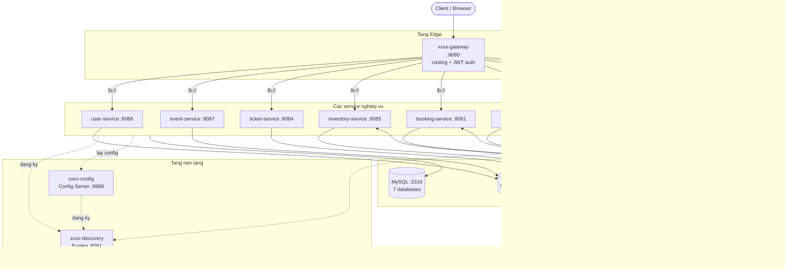
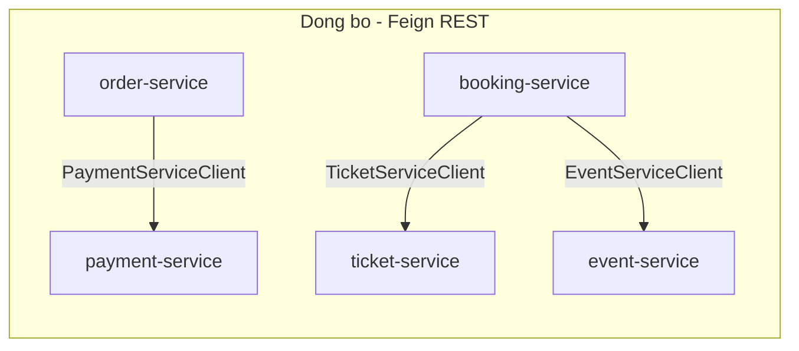
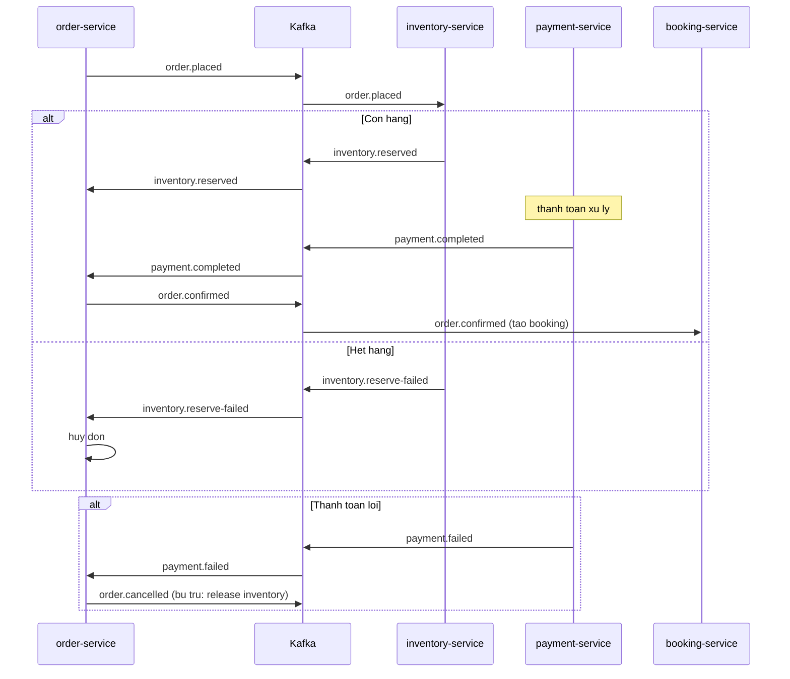
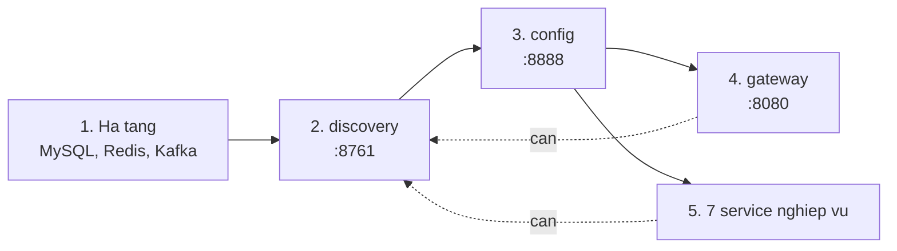
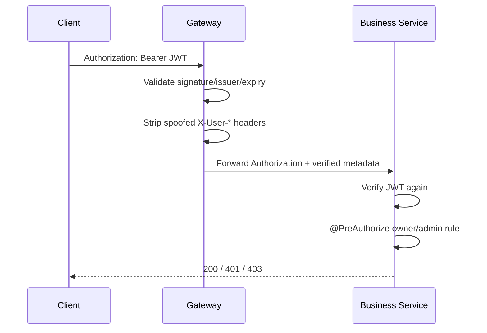
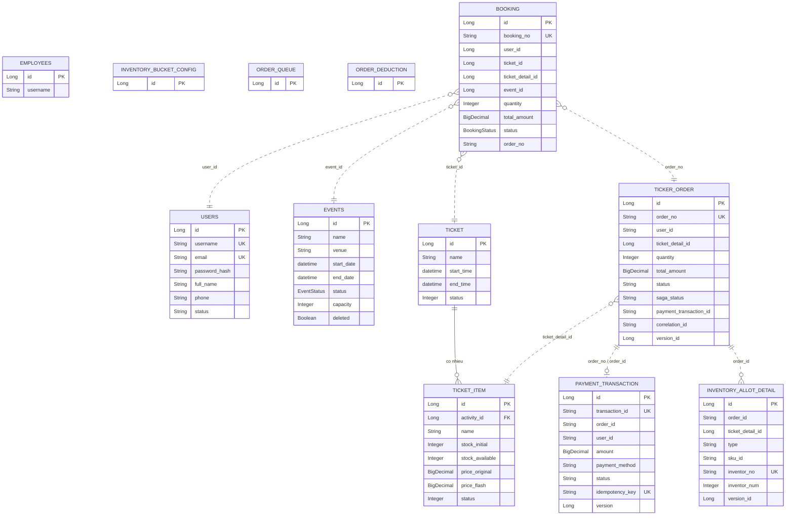
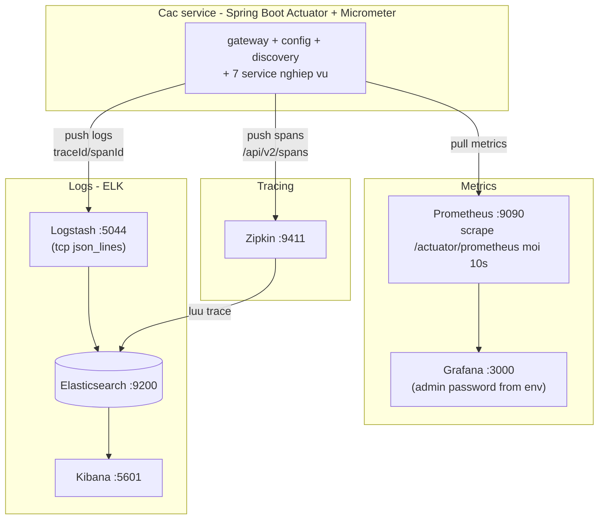
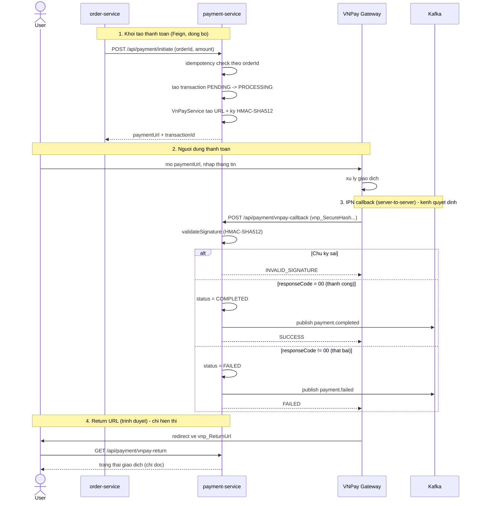
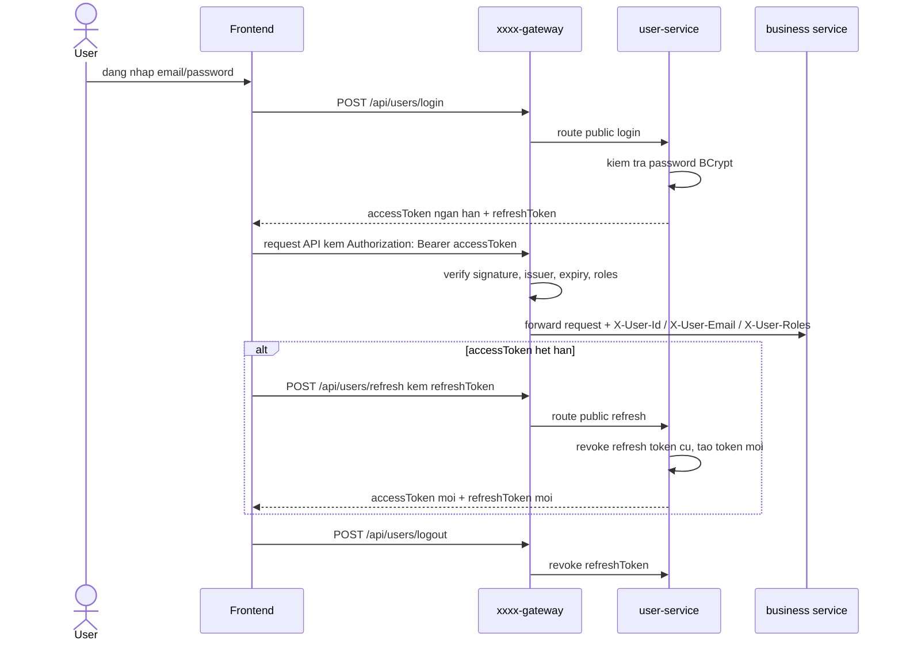

# Kiến trúc tổng quan - xxxx Microservices

Tài liệu này mô tả kiến trúc tổng thể của hệ thống bán vé (ticketing) xây dựng theo
mô hình microservices với Spring Boot 3.3.5 / Spring Cloud 2023.0.3.

> Các sơ đồ dùng định dạng [Mermaid](https://mermaid.js.org/). Xem trực tiếp trong
> trình xem Markdown hỗ trợ Mermaid.

## 1. Kiến trúc tổng thể

## 2. Giao tiep giua cac service

Hai kieu giao tiep: dong bo qua Feign (REST + load-balance qua Eureka) va bat dong bo qua Kafka.

Moi Feign client deu co fallback (Resilience4j circuit breaker) - neu service dich chet
thi co hanh vi du phong thay vi sap theo.

## 3. Luong Saga dat ve (qua Kafka)

Saga dieu phoi boi order-service, co bu tru (compensation) khi that bai.

### Danh sach Kafka topic

| Topic | Producer | Consumer |
|-------|----------|----------|
| `order.placed` | order-service | inventory-service |
| `inventory.reserved` | inventory-service | order-service |
| `inventory.reserve-failed` | inventory-service | order-service |
| `payment.completed` | payment-service | order-service |
| `payment.failed` | payment-service | order-service |
| `order.confirmed` | order-service | booking-service |
| `order.cancelled` | order-service | (bu tru inventory) |

## 4. Thu tu khoi dong & phu thuoc

### Docker Compose profiles

De may dev nhe hon va de tach ro surface khi deploy, `docker-compose.yml` da duoc chia theo 4 profile:

- `infra`: MySQL, Redis, Zookeeper, Kafka.
- `platform`: discovery, config, gateway.
- `business`: cac service nghiep vu.
- `observability`: Prometheus, Grafana, ELK, Zipkin.

Kieu tach nay giup local dev co the chi bat `infra` hoac `infra + platform`, trong khi VPS co the
bat `infra + platform + business`; observability chi bat khi can.

## 5. Vai tro cac thanh phan

| Nhom | Service | Port | Vai tro |
|------|---------|------|---------|
| Edge | xxxx-gateway | 8080 | Cua ngo duy nhat, routing, xac thuc JWT |
| Nen tang | xxxx-discovery | 8761 | Service registry (Eureka) |
| Nen tang | xxxx-config | 8888 | Cau hinh tap trung (Config Server) |
| Nghiep vu | xxxx-user-service | 8086 | Nguoi dung, dang nhap, nhan vien |
| Nghiep vu | xxxx-event-service | 8087 | Su kien |
| Nghiep vu | xxxx-ticket-service | 8084 | Loai ve, chi tiet ve |
| Nghiep vu | xxxx-inventory-service | 8085 | Ton kho ve (reserve/release) |
| Nghiep vu | xxxx-booking-service | 8081 | Dat cho |
| Nghiep vu | xxxx-order-service | 8082 | Dieu phoi saga dat hang |
| Nghiep vu | xxxx-payment-service | 8083 | Thanh toan (VNPay) |
| Ha tang | MySQL / Redis / Kafka | 3316 / 6319 / 9094 | Luu tru / cache / message bus |
| Quan sat | Prometheus, Grafana, ELK, Zipkin | - | Metrics, log, tracing |

### Ghi chu moi cho inventory-service

Sau cap nhat flash sale A1, `inventory-service` khong con chi dung 1 key Redis `stock:available:{ticketDetailId}`
cho duong giu ve hot. Neu co bucket config mac dinh, service se chia ton kho thanh nhieu bucket:

- key ton kho: `stock:available:{ticketDetailId}:{bucketIndex}`
- key khoa: `lock:inventory:{ticketDetailId}:{bucketIndex}`

Bucket duoc chon theo hash `orderId`, giup cac request song song vao nhieu bucket khac nhau thay vi tranh
nhau tren 1 hot row duy nhat. Khi bucket dang xu ly sap can, service co co che `back-source` chuyen bot ton tu
bucket khac sang theo `thresholdValue`, `backSourceStep`, `minDepthNum` trong `InventoryBucketConfigEntity`.

### Ghi chu moi cho auth B5

Tu cap nhat B5, he thong dung mo hinh **Gateway authenticate, Service authorize**:

- `xxxx-gateway` la lop xac thuc dau vao: validate chu ky JWT, issuer va expiry cho endpoint private.
- Gateway xoa cac identity header do client tu gui (`X-User-Id`, `X-User-Email`, `X-User-Roles`) de chan gia mao quyen.
- Gateway forward nguyen `Authorization: Bearer <token>` xuong service; `X-User-*` chi con la metadata phu cho log/debug.
- Cac service nghiep vu tu verify JWT lai bang shared helper trong `xxxx-common`, tao principal noi bo va dung `@PreAuthorize` de quyet dinh quyen theo nghiep vu.
- Cac rule owner/admin nam trong service: user chi xem sua tai nguyen cua minh, `ADMIN` moi duoc thao tac quan tri.`r`n- Public endpoints vẫn đi qua public allow-list rõ ràng: `login/register/refresh`, VNPay callback/return và GET event listing.

## 6. Cau hinh tap trung (Config Server)

Cac service lay cau hinh tu Config Server luc khoi dong (`spring.config.import`).
Nguon cau hinh duy nhat nam o `environment/config-repo/`:

- `application.yml` - cau hinh chung cho moi service (Eureka, actuator, resilience4j...)
- `xxxx-<ten-service>-dev.yml` - cau hinh rieng tung service (port, datasource, kafka...)

Config Server doc thu muc nay qua `search-locations`, va co the override bang bien moi
truong `CONFIG_SEARCH_LOCATIONS` khi deploy len VPS.

## 7. So do ERD (database-per-service)

Moi service so huu mot database rieng (database-per-service). KHONG co khoa ngoai vat ly
xuyen service - cac lien ket giua database khac nhau chi la lien ket logic qua ID
(ve duong gach `..>`). Khoa ngoai vat ly chi ton tai trong cung mot database.

### Banh xa databases

| Database | Service so huu | Bang chinh |
|----------|----------------|------------|
| `user_db` | user-service | users, employees |
| `event_db` | event-service | events |
| `ticket_db` | ticket-service | ticket, ticket_item |
| `inventory_db` | inventory-service | inventory_allot_detail, inventory_bucket_config |
| `order_db` | order-service | ticker_order, order_queue, order_deduction |
| `payment_db` | payment-service | payment_transaction |
| `booking_db` | booking-service | booking |

> Diem dang chu y: nhieu bang dung `@Version` (optimistic locking) va cac cot
> `inventor_no` / `idempotency_key` lam khoa idempotency - phuc vu xu ly concurrent
> va chong xu ly trung trong luong saga.

## 8. So do Observability (giam sat)

He thong dung 3 tru cot quan sat: metrics (Prometheus + Grafana), logs (ELK), va
distributed tracing (Zipkin).

### Co che thu thap

| Tru cot | Cong cu | Co che | Ghi chu |
|---------|---------|--------|---------|
| Metrics | Prometheus -> Grafana | PULL: scrape `/actuator/prometheus` moi 10s | Datasource Grafana tro toi `prometheus:9090` |
| Logs | Logstash -> Elasticsearch -> Kibana | PUSH: log gui qua TCP 5044 dang json_lines | Index theo `xxxx-logs-<service>-<ngay>` |
| Tracing | Zipkin (luu vao Elasticsearch) | PUSH: span gui toi `/api/v2/spans` | Tuong quan qua `traceId` / `spanId` trong MDC |

> Log va trace duoc lien ket qua `traceId`/`spanId` (Logstash trich tu MDC), cho phep
> nhay tu mot dong log sang trace tuong ung de debug xuyen service.

## 9. Luong thanh toan VNPay

VNPay tach lam 2 kenh tra ket qua doc lap:
- **IPN callback** (`POST /api/payment/vnpay-callback`): VNPay goi server-to-server. Day la
  kenh DUY NHAT cap nhat trang thai va publish event Kafka (payment.completed/failed).
- **Return URL** (`GET /api/payment/vnpay-return`): trinh duyet nguoi dung redirect ve sau
  khi thanh toan. CHI doc va hien thi trang thai, KHONG cap nhat DB, KHONG publish event.

Tach 2 kenh la dung chuan: trang thai tien luon dua tren IPN (server-to-server, dang tin
cay), khong phu thuoc nguoi dung co bam quay lai hay khong.

Sau buoc 3, event `payment.completed` / `payment.failed` di vao saga o muc 3 (order-service
tieu thu de xac nhan hoac huy don).

### Trang thai xu ly truoc khi len VPS

| Hang muc | Vi tri | Trang thai |
|--------|--------|------------|
| `secret-key` VNPay | `VnPayService`, config-repo | Lay tu `VNPAY_SECRET_KEY`, khong con default hardcode |
| `vnp_IpAddr` | `PaymentController` -> `VnPayService.createPaymentUrl` | Lay tu `X-Forwarded-For`, `X-Real-IP`, fallback `remoteAddr` |
| `return-url` | `xxxx-payment-service-dev.yml`, `VnPayService` | Dung `VNPAY_RETURN_URL`, default local qua gateway `/api/payment/vnpay-return` |
| callback URL public | gateway `public-endpoints` | `/api/payment/vnpay-callback` va `/api/payment/vnpay-return` bo qua JWT |
| Tra cuu transaction theo `txnRef` | `PaymentTransactionEntity`, `PaymentRepository` | Da co cot `txnRef` unique index va query `findByTxnRef` |

> `vnpay.return-url` va `vnp_ReturnUrl` tro toi gateway (`/api/payment/vnpay-return`) - dung,
> vi gateway la cua ngo public duy nhat. Tren VPS set `VNPAY_RETURN_URL` bang domain that.

## 10. Luong xac thuc & phan quyen hien tai

Cap nhat ngay 2026-06-02: luong xac thuc da chuyen sang mo hinh gateway-first dung hon cho
microservices. Frontend khong nhap JWT gateway thu cong nua; token duoc cap boi `user-service`
sau khi dang nhap va duoc gateway kiem tra o moi request can bao ve.

### Nguyen tac bao mat da ap dung

| Hang muc | Cach xu ly |
|----------|------------|
| Password | Luu bang BCrypt cost 12. User cu dung SHA-256 duoc migrate sang BCrypt sau lan login thanh cong. |
| Access token | JWT ngan han, ky HMAC bang `JWT_SECRET`, co `issuer`, `jti`, `email`, `roles`. |
| Refresh token | Token random, chi luu hash trong DB, rotate moi lan refresh, revoke khi logout. |
| Gateway | La diem validate JWT va phan quyen role. Service nghiep vu nhan identity qua header noi bo. |
| Role | User mac dinh `USER`; endpoint quan tri/mutating can `ADMIN` tai gateway. |
| Config | `JWT_SECRET` bat buoc lay tu bien moi truong va dai toi thieu 32 ky tu. |

### Endpoint public lien quan auth

| Endpoint | Ghi chu |
|----------|---------|
| `POST /api/users/register` | Dang ky tai khoan, mat khau luu BCrypt. |
| `POST /api/users/login` | Dang nhap, cap access token va refresh token. |
| `POST /api/users/refresh` | Doi refresh token lay access token moi. |
| `POST /api/users/logout` | Thu hoi refresh token. |

### Endpoint can role ADMIN tai gateway

- Toan bo `/api/employees/**`.
- Cac request ghi du lieu (`POST`, `PUT`, `PATCH`, `DELETE`) tren `/api/events`, `/api/tickets`,
  `/api/ticket-details`, `/api/inventory`.

Day la lop phan quyen o edge. Neu muon chat hon nua cho production, buoc tiep theo nen them
kiem tra authorization trong tung service quan trong de phong truong hop service bi goi truc tiep
trong mang noi bo.

## 11. Waiting room cho flash sale

Sau cap nhat A2, `order-service` khong day thang moi request mua ve vao Saga nua. `placeOrder()` tao
`OrderEntity` trang thai `QUEUED`, cap `queueToken`, luu `OrderQueueEntity` status `WAITING` va tra token
cho client. Worker dinh ky trong `OrderServiceImpl.processWaitingRoomBatch()` moi lay cac item `WAITING`
theo `priority ASC, createdAt ASC`, gioi han so item `PROCESSING` dong thoi bang
`order.waiting-room.max-processing`, roi moi publish `OrderPlacedEvent` vao Kafka.

Token cho qua lau se duoc cap nhat thanh `EXPIRED` theo `order.waiting-room.token-ttl-minutes`. Khi saga thanh
cong hoac that bai, queue item duoc chuyen sang `COMPLETED` de dong vong doi waiting room.

## 12. Auth hardening trong user-service

`user-service` da bo sung 3 lop hardening nho truoc khi len VPS:

- `AdminBootstrapRunner`: co the tao tai khoan `ADMIN` ban dau tu bien moi truong khi bat
  `AUTH_BOOTSTRAP_ADMIN_ENABLED=true`.
- `AuthRateLimitService`: gioi han tan suat cho `login` va `refresh` theo cua so thoi gian ngan de
  giam brute-force/co gang spam refresh token.
- Auth lifecycle tests: kiem tra duong di `login -> refresh -> logout` o tang service de tranh hoi quy.
