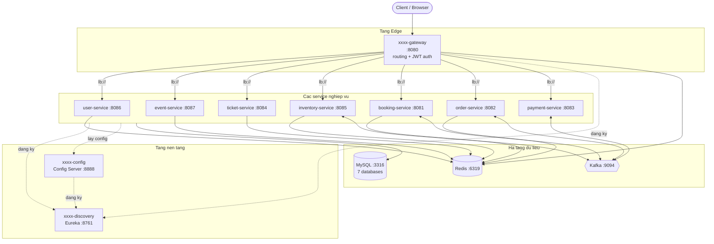
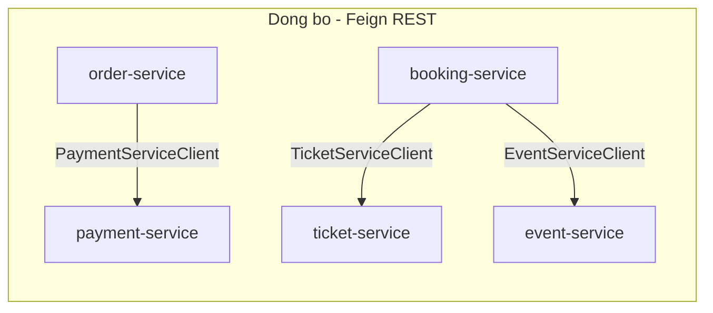
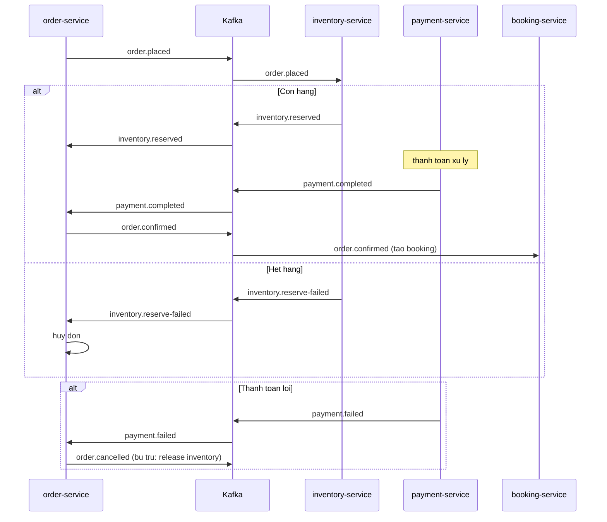
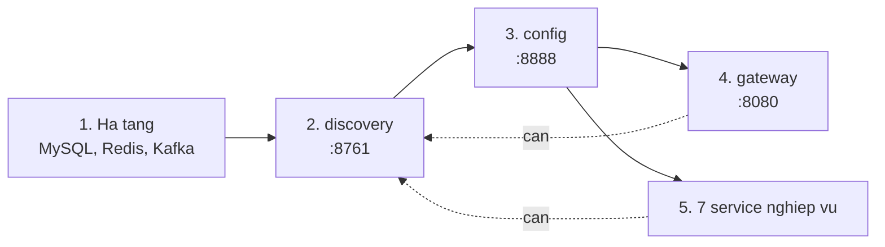
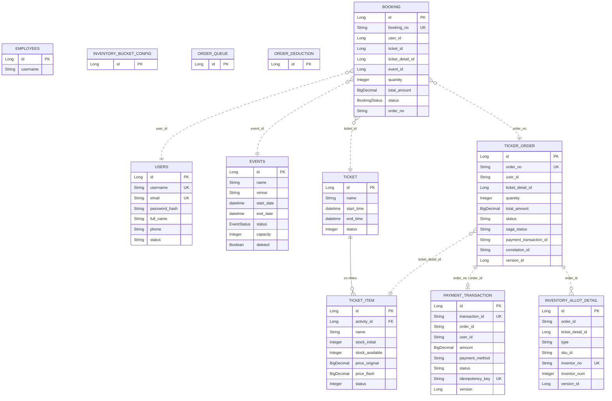
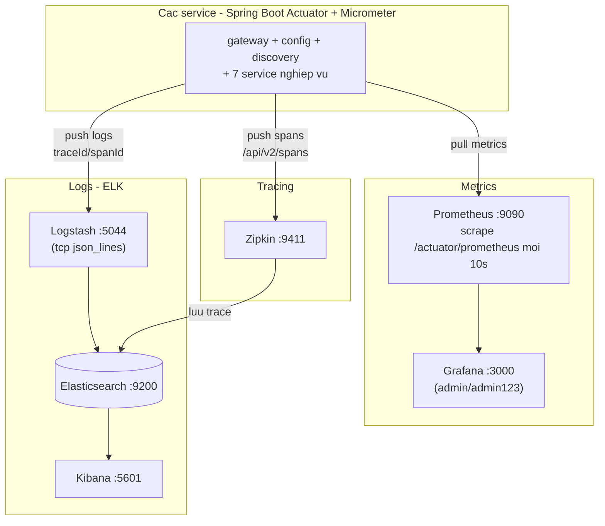
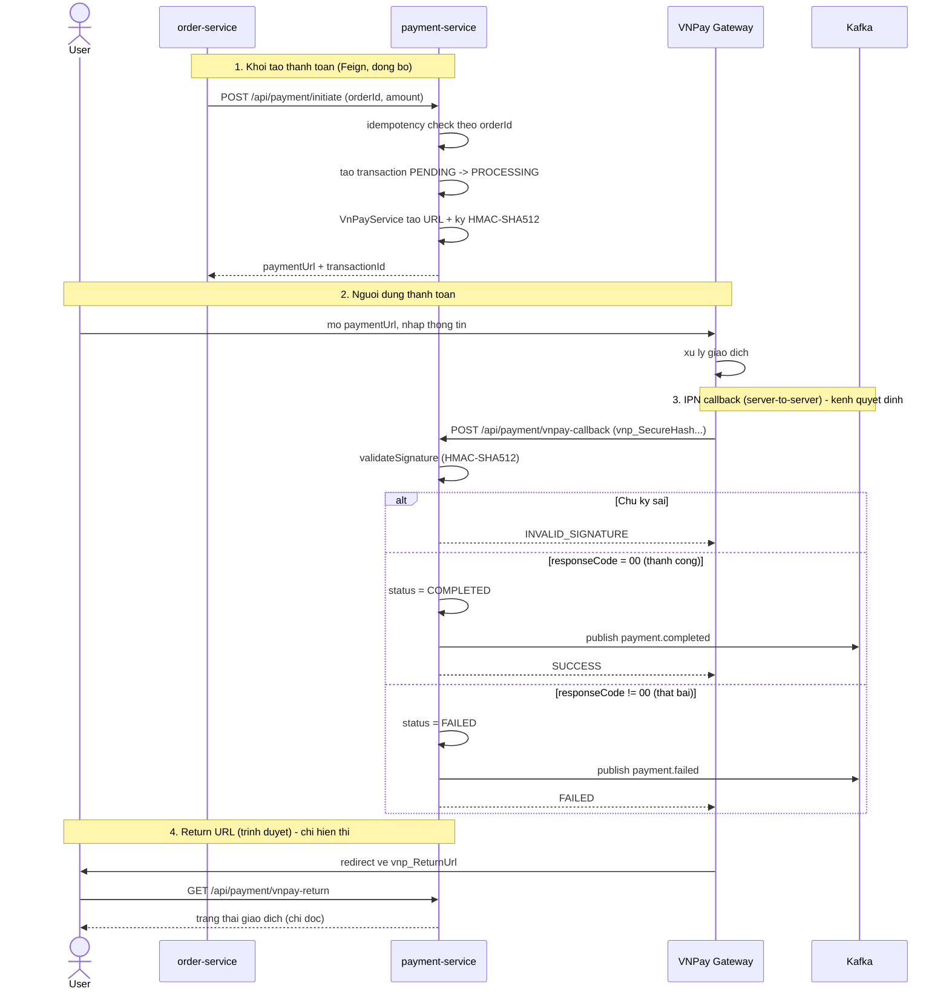

# Kiến trúc tổng quan - xxxx Microservices

Tài liệu này mô tả kiến trúc tổng thể của hệ thống bán vé (ticketing) xây dựng theo
mô hình microservices với Spring Boot 3.3.5 / Spring Cloud 2023.0.3.

> Các sơ đồ dùng định dạng [Mermaid](https://mermaid.js.org/). Xem trực tiếp trong
> trình xem Markdown hỗ trợ Mermaid.

## 1. Kiến trúc tổng thể

## 2. Giao tiep giua cac service

Hai kieu giao tiep: dong bo qua Feign (REST + load-balance qua Eureka) va bat dong bo qua Kafka.

Moi Feign client deu co fallback (Resilience4j circuit breaker) - neu service dich chet
thi co hanh vi du phong thay vi sap theo.

## 3. Luong Saga dat ve (qua Kafka)

Saga dieu phoi boi order-service, co bu tru (compensation) khi that bai.

### Danh sach Kafka topic

| Topic | Producer | Consumer |
|-------|----------|----------|
| `order.placed` | order-service | inventory-service |
| `inventory.reserved` | inventory-service | order-service |
| `inventory.reserve-failed` | inventory-service | order-service |
| `payment.completed` | payment-service | order-service |
| `payment.failed` | payment-service | order-service |
| `order.confirmed` | order-service | booking-service |
| `order.cancelled` | order-service | (bu tru inventory) |

## 4. Thu tu khoi dong & phu thuoc

## 5. Vai tro cac thanh phan

| Nhom | Service | Port | Vai tro |
|------|---------|------|---------|
| Edge | xxxx-gateway | 8080 | Cua ngo duy nhat, routing, xac thuc JWT |
| Nen tang | xxxx-discovery | 8761 | Service registry (Eureka) |
| Nen tang | xxxx-config | 8888 | Cau hinh tap trung (Config Server) |
| Nghiep vu | xxxx-user-service | 8086 | Nguoi dung, dang nhap, nhan vien |
| Nghiep vu | xxxx-event-service | 8087 | Su kien |
| Nghiep vu | xxxx-ticket-service | 8084 | Loai ve, chi tiet ve |
| Nghiep vu | xxxx-inventory-service | 8085 | Ton kho ve (reserve/release) |
| Nghiep vu | xxxx-booking-service | 8081 | Dat cho |
| Nghiep vu | xxxx-order-service | 8082 | Dieu phoi saga dat hang |
| Nghiep vu | xxxx-payment-service | 8083 | Thanh toan (VNPay) |
| Ha tang | MySQL / Redis / Kafka | 3316 / 6319 / 9094 | Luu tru / cache / message bus |
| Quan sat | Prometheus, Grafana, ELK, Zipkin | - | Metrics, log, tracing |

## 6. Cau hinh tap trung (Config Server)

Cac service lay cau hinh tu Config Server luc khoi dong (`spring.config.import`).
Nguon cau hinh duy nhat nam o `environment/config-repo/`:

- `application.yml` - cau hinh chung cho moi service (Eureka, actuator, resilience4j...)
- `xxxx-<ten-service>-dev.yml` - cau hinh rieng tung service (port, datasource, kafka...)

Config Server doc thu muc nay qua `search-locations`, va co the override bang bien moi
truong `CONFIG_SEARCH_LOCATIONS` khi deploy len VPS.

## 7. So do ERD (database-per-service)

Moi service so huu mot database rieng (database-per-service). KHONG co khoa ngoai vat ly
xuyen service - cac lien ket giua database khac nhau chi la lien ket logic qua ID
(ve duong gach `..>`). Khoa ngoai vat ly chi ton tai trong cung mot database.

### Banh xa databases

| Database | Service so huu | Bang chinh |
|----------|----------------|------------|
| `user_db` | user-service | users, employees |
| `event_db` | event-service | events |
| `ticket_db` | ticket-service | ticket, ticket_item |
| `inventory_db` | inventory-service | inventory_allot_detail, inventory_bucket_config |
| `order_db` | order-service | ticker_order, order_queue, order_deduction |
| `payment_db` | payment-service | payment_transaction |
| `booking_db` | booking-service | booking |

> Diem dang chu y: nhieu bang dung `@Version` (optimistic locking) va cac cot
> `inventor_no` / `idempotency_key` lam khoa idempotency - phuc vu xu ly concurrent
> va chong xu ly trung trong luong saga.

## 8. So do Observability (giam sat)

He thong dung 3 tru cot quan sat: metrics (Prometheus + Grafana), logs (ELK), va
distributed tracing (Zipkin).

### Co che thu thap

| Tru cot | Cong cu | Co che | Ghi chu |
|---------|---------|--------|---------|
| Metrics | Prometheus -> Grafana | PULL: scrape `/actuator/prometheus` moi 10s | Datasource Grafana tro toi `prometheus:9090` |
| Logs | Logstash -> Elasticsearch -> Kibana | PUSH: log gui qua TCP 5044 dang json_lines | Index theo `xxxx-logs-<service>-<ngay>` |
| Tracing | Zipkin (luu vao Elasticsearch) | PUSH: span gui toi `/api/v2/spans` | Tuong quan qua `traceId` / `spanId` trong MDC |

> Log va trace duoc lien ket qua `traceId`/`spanId` (Logstash trich tu MDC), cho phep
> nhay tu mot dong log sang trace tuong ung de debug xuyen service.

## 9. Luong thanh toan VNPay

VNPay tach lam 2 kenh tra ket qua doc lap:
- **IPN callback** (`POST /api/payment/vnpay-callback`): VNPay goi server-to-server. Day la
  kenh DUY NHAT cap nhat trang thai va publish event Kafka (payment.completed/failed).
- **Return URL** (`GET /api/payment/vnpay-return`): trinh duyet nguoi dung redirect ve sau
  khi thanh toan. CHI doc va hien thi trang thai, KHONG cap nhat DB, KHONG publish event.

Tach 2 kenh la dung chuan: trang thai tien luon dua tren IPN (server-to-server, dang tin
cay), khong phu thuoc nguoi dung co bam quay lai hay khong.

Sau buoc 3, event `payment.completed` / `payment.failed` di vao saga o muc 3 (order-service
tieu thu de xac nhan hoac huy don).

### Diem can xu ly truoc khi len VPS

| Van de | Vi tri | Anh huong |
|--------|--------|-----------|
| `secret-key` co gia tri mac dinh hardcode | `VnPayService` | Bao mat - phai dua ra bien moi truong / secret |
| `vnp_IpAddr` co dinh `127.0.0.1` | `VnPayService.createPaymentUrl` | VNPay co the tu choi/sai IP that |
| `return-url` mac dinh `127.0.0.1:8080`, config-repo lai ghi `localhost:3000/payment/return` | `VnPayService` vs `xxxx-payment-service-dev.yml` | Khong khop - tren VPS phai la domain public that |
| callback URL phai PUBLIC de VNPay goi vao | gateway `public-endpoints` | Tren VPS can mo `/api/payment/vnpay-callback` ra internet (da khai bao public, bo qua JWT) |
| `findTransactionByTxnRef` dung `findAll().stream()` | `PaymentServiceImpl` | Quet toan bang - cham khi du lieu lon, nen luu `txnRef` thanh cot rieng co index |

> `vnpay.return-url` va `vnp_ReturnUrl` tro toi gateway (`/api/payment/vnpay-return`) - dung,
> vi gateway la cua ngo public duy nhat. Tren VPS thay `127.0.0.1`/`localhost` bang domain that.
